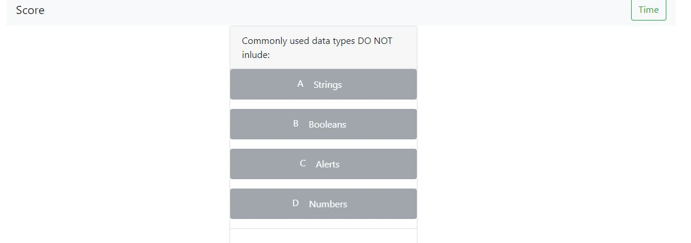

# Code-Quiz

## SCREENSHOT

## Features

User will take a brief 5 question quiz about coding. The timer is set at 50, once it expires the quiz will end. The score is kept and saved to local storage.

## Link

https://kmsaunders7.github.io/Code-Quiz/